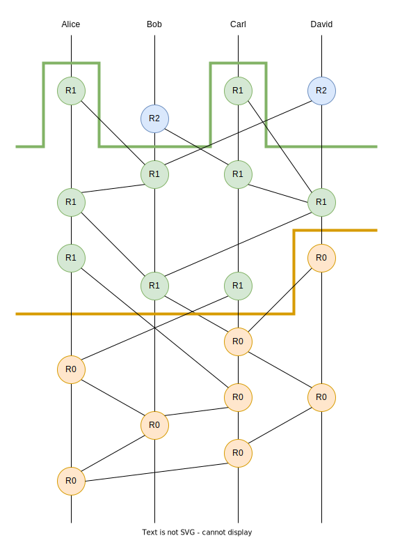
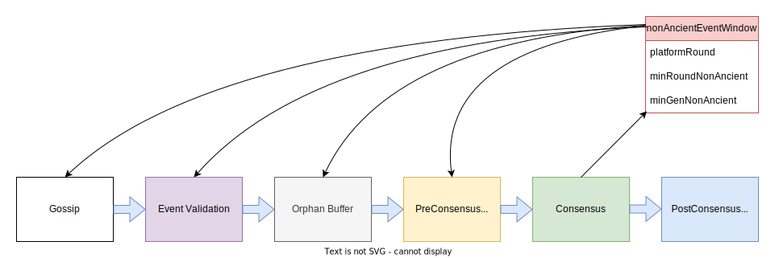

# Dynamic AddressBook (DAB)

This document details the initial top level design for dynamic address book and defines key concepts and properties
that must be factored into the implementation of dynamic address book. This document will need to be updated to
match any changes to the implementation. Adjacent documentation goes into more detail on the implementation of
dynamic address book.

The end goal of the dynamic address book effort is to allow the address book to be updated through `Hedera API (HAPI)
transactions` without requiring a software upgrade or network restart.

# History and Background

Prior to the dynamic address book effort, the platform's address book was static during the execution of the nodes
on the network. Adding a node or removing a node to the address book would require a software upgrade and network
wide restart for the nodes to pick up a new address book through `config.txt`. Outside the maintenance window of
performing a software upgrade, the address book was saved to the state and used on node restarts, ignoring `config.txt`.

During the initial design phase of the dynamic address book effort, there was a push to merge the two concepts of
address book, one in the application, and one in the platform. The final result was that the platform still needed
its own separate data structure. The platform's address book has been renamed to `Consensus Roster` or `Roster`.
The consensus roster tells the platform which nodes are creating events and participating in consensus and provides
the necessary metadata from each node such as node weight, public keys, and gossip endpoints.

The platform's `ConsensusRoster` and the application's `AddressBook` are deeply related but do not have the same
lifecycle. Non-Platform impacting changes to the address book can take effect in the round when the HAPI
transactions are handled. Because consensus happens in a pipeline, changes to the consensus roster cannot take
effect the same round a new roster is created. At minimum the new roster must wait the number of rounds in the
pipeline before it can take effect. If nodes are added or removed or keys are rotated, coordination between nodes
for re-keying protocols may increase the number of rounds before a new consensus roster can take effect.

# Definitions and Properties for the Platform and Consensus

The `state` is a data structure called a `MerkleTree`. It contains all the durable information that can change over
time through processing `transactions`. If processing a transaction does not modify a piece of the state, that part
of the state remains unchanged.

Each node can receive transactions. The transactions it receives are gossiped to other nodes in batches called
`Events`. Each event created by a node has a reference to the node's last created event and to one or
more events created by other nodes. The events referenced in this way are called `parents` and the Directed
Acyclic Graph (DAG) formed through parent linking is called a `Hashgraph`. Each event has a property called
`generation` which is 1 + the maximum generation value of all of its parents. The latest event from a node in a
hashgraph is at the `tip of the hashgraph` for that node. The set of events that are at the tip of the hashgraph
across all nodes is called the `tipset`. When a new event is created, the parents from other nodes are chosen from the
tipset of the current hashgraph.

The following terminology is taken from the Carnegie Mellon University paper [_**Verifying the Hashgraph Consensus
Algorithm**_ by Karl Crary](https://www.cs.cmu.edu/~crary/papers/2021/hashgraph.pdf).  The consensus algorithm 
determines two properties `the round that an event belongs to` and `the round that the network receives the event`. 
This latter property determines the `consensus timestamp` for the event and the `consensus order` in which events' 
transactions are processed.

The events in a Hashgraph are partitioned into consecutive `Rounds`. To determine which round an event belongs to, we
first must define the property of `Strongly Seeing`. Event A can strongly see event B if for a super majority of
nodes there exists a path from A to B in the Hashgraph that traverses through an event created by that node. _For
Event X, let B be the maximum round that all of X's parents belong to. X belongs to round B unless X can strongly
see an event in round B, in which case it belongs to round B+1_. In the diagram below, all the nodes labeled `R1`
can strongly see one or more nodes labeled `R0`, all nodes labeled `R2` can strongly see one or more nodes labeled
`R1`, and so on. All nodes labeled `R0` belong to round 0. All nodes labeled `R1` belong to round 1, and so on.

To determine the round in which the network receives an event, we must define a few more properties. The first event
from each node in a round is called a `witness`. A witness in round R is called `famous` if, for a
super majority of nodes, it can be strongly seen by a witness in a later round R+d, d > 0. The process of
determining fame is called `voting`. Witnesses in later rounds vote on the fame of witnesses in earlier rounds. An
honest node will have at most one witness in each round, making it a unique witness for the node in that round.
If a dishonest node creates multiple witnesses, one is chosen to be considered the `unique famous witness` for
that node for that round.  _An event X is `received by the network` in round R if R is the least round such that X
is an ancestor of all the unique famous witnesses in round R_.  **Note:** The round B that an event belongs to is
necessarily less than the round R in which it is received by the network and given a consensus timestamp and order.
The diagram does not depict what round the events are received, just the rounds to which the events belong.

In our code, all events which have been received by the network in the same round are bundled into the same
`ConsensusRound` object. The addition of a single event to the hashgraph can cause multiple rounds to have their
unique famous witnesses determined, which may cause one or more prior rounds to come to consensus,
producing a sequence of `ConsensusRound` objects for post-consensus handling. Each `ConsensusRound` object
contains the effective `consensus roster` that determined consensus on that round. Only the nodes in the 
effective consensus roster's witnesses can vote on the fame of prior witnesses.  (?? This last sentence needs to be 
verified ??)

When receiving events through gossip, we need to validate the events with respect to the  effective consensus roster 
when the event was created. Let R be the last round to come to consensus. We define the `platformRound` to be R+1, 
or the next round the platform is working towards consensus on. Consensus rosters are created in the handling of 
transactions in one round and become effective on the platform in a later round. The `rosterCreationRound`
is the `ConsensusRound` that created the roster. The `rosterEffectiveRound` is the `platformRound` that the
consensus roster becomes effective on. There is a minimum `rosterEffectiveOffset` which dictates the minimum number
of rounds between the `rosterCreationRound` and the `rosterEffectiveRound`. If the platform needs to go through a
re-keying process, this may cause the `rosterEffectiveRound` to be higher than `rosterCreationRound +
rosterEffectiveOffset`. The new roster cannot become effective until the platform has been re-keyed to be compatible
with the roster. When new events are created, they are annotated with the current `platformRound`. In a
history of consensus rosters, the consensus roster that was effective during an event's creation is the roster
with the greatest `effectiveRosterRound` that is less than or equal to the event's `platformRound`.

With the introduction of dynamic address book and changing consensus rosters, there are now 3 distinct round values
relevant to events. It is important to understand the distinction between all of them:

1. The event's `platformRound`, the round it was created, is 1 + the latest round to come to consensus on the platform.
2. the `round an event belongs to` is 1 + the highest round with events that this event can strongly see. 
3. the `round an event X is received` or `ConsensusRound` containing X is the first round in which X is an ancestor of 
   all the unique famous witnesses in that round.

As the computation of consensus advances in round number, it is possible that there are events which do
not or cannot be given a `ConsensusRound` value, they will never become ancestors of unique famous witnesses in
later rounds. These events are called `stale`. The mathematical proof that stale events will never reach consensus
is beyond the scope of this documentation. In the platform, the `consensus.roundsNonAncient` configurable value
indicates the number of rounds before an event becomes `ancient`. If an event has become ancient, and it has not
reached consensus, it is `stale` and will never reach consensus. An event is called `ancient` when its
`platformRound` value is older than the platform's current `platformRound` minus `consensus.roundsNonAncient`.

(?? This next paragraph's assertions needs to be validated ??)
Consensus is able to calculate a tighter bound for ancient events using the minimum generation of the witness
events that belong to the next `platformRound` that is coming to consensus. This threshold for generation value is
called `minGenNonAncient`. If an event has a generation less than `minGenNonAncient` it is `ancient` and if it has
not come to consensus yet, it is `stale`.

We can intuitively see that if a new event has been given parents which belong to a very old round, meaning there
are multiple rounds of events that can see the parents, then the generation of the new event will be low, it is
not at the tip of the hashgraph, and it will never be chosen as a parent itself. If the event is not chosen
as a parent for other events, it will never reach consensus and be seen by a unique famous witnesses in later rounds.

# The Platform's Event Pipeline

Events are handled in a pipeline of stages. Events may come into a node through gossip out of order. After being
received by gossip, the events are validated and then sit in an orphan buffer until all of its parents become
present or have become ancient. Events are released from the Orphan buffer in topological order, meaning that all
parents of an event emerge before the event itself. Prior to entering consensus, a preConsensus event stream is
recorded to disk and any interested parties can receive the events for inspection and handling. Events that are
handled pre-consensus must not alter the state. All state changes made by processing transactions must happen in
post-consensus round handling.

Currently, there is no concurrency in post consensus round handling. The transactions in events in a round are
processed on a single thread. Since all state changes happen in one thread, no locking mechanisms are required.
The introduction of concurrent transaction handling will require partitioning the state into pieces and the
processing of each transaction would need to lock the pieces of the state the transaction modifies. Transactions
which do not touch the same piece of state can be executed in parallel.

As consensus advances, advancing the `platformRound` of the platform, so does the threshold by which events are
considered ancient. This moving event window for non-ancient events is called the `nonAncientEventWindow`. It
contains the current `platformRound` and the minimum round for non-ancient events, called `minRoundNonAncient`. Each
`ConsensusRound` defines a new `nonAncientEventWindow`. If multiple rounds come to consensus from adding a single
event, then the latest `ConsensusRound`'s `nonAncientEventWindow` is disseminated to all components in the platform
and its `platformRound` value becomes the platform's `platformRound` value. Any events which have become `ancient`
by having their `platformRound` value less than the `minRoundNonAncient` value are purged from the platform. Events
that are handled in pre-consensus but become `ancient` during the calculation of consensus are processed as `stale`
events.

When a new `nonAncientEventWindow` is received by components, they update their understanding of the current
`platformRound` and the current `minRoundNonAncient` and `minGenNonAncient` values.

The effective consensus roster during each round in the `nonAncientEventWindow` must be kept on hand for event
validation and consensus. In validation of an event, the event's `platformRound` is used to look up the effective
consensus roster for that round. If the node creating the event is not in the roster for that round, it is
discarded. In consensus, the effective consensus roster for the current `platformRound` determines which
nodes can contribute voting witness events and which nodes contribute events in the paths of the `strongly see`
property.

# Address Book HAPI Transaction Lifecycle.

We can break up Address Book modifying HAPI transactions into two classes. Those which impact the consensus
roster and those which do not. The transactions which do not impact the consensus roster can take effect as soon as the
transaction is handled post-consensus. The transactions which impact the consensus roster have the following
lifecycle:

1. The transaction is submitted to a node.
2. The transaction is packed into an event and gossiped throughout the network.
3. The event comes to consensus and is handled in post-consensus round handling.
4. The application handles all transactions of all events in the `ConsensusRound`.
5. If there are multiple transactions which impact the consensus roster, their accumulated effect is applied
   together to create a new consensus roster which is submitted to the platform at the end of handling the round.
6. The handled `ConsensusRound`'s round value becomes the `rosterCreationRound` for the new roster.
7. The application must wait to be notified in a future `ConsensusRound` that the roster has taken effect.
8. If re-keying the network is needed, the platform prepares the re-key and schedules it to take effect along
   with the new roster on a future round.
9. If no re-keying is necessary, the platform determines the effective round for the new roster by adding the
   `rosterEffectiveOffset` to the `ConsensusRound`'s round and disseminates the new roster to relevant components.
10. When the update of the `nonAncientEventWindow` indicates the `platformRound` has advanced to match the
    round the roster is schedule to become effective, the new roster replaces the old roster in all components,
    including consensus.
11. The next `ConsensusRound` generated by consensus will have the new roster as its effective roster.
